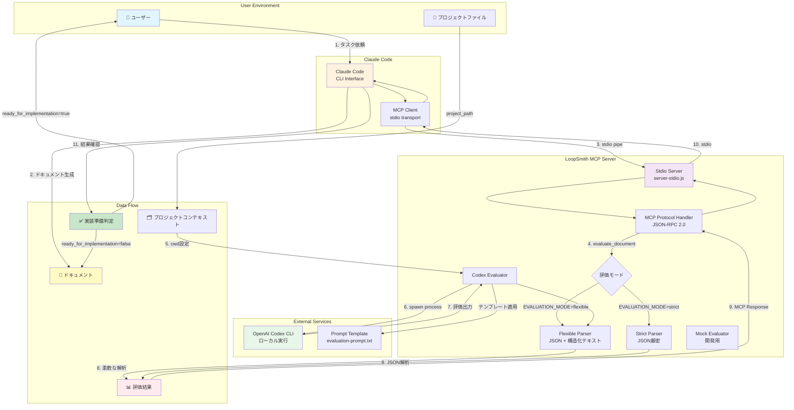

# LoopSmith アーキテクチャ

## システム概要

LoopSmithは、Claude CodeとOpenAI Codexを統合した自動ドキュメント評価・改善システムです。MCP (Model Context Protocol) 標準に準拠したstdio通信を採用し、実装準備判定と柔軟な評価形式をサポートします。

## アーキテクチャ図



## コンポーネント詳細

### 1. Claude Code & MCP Client
- **役割**: ユーザーインターフェースとMCPクライアント機能
- **通信方式**: stdio (標準入出力)
- **プロトコル**: MCP 2024-11-05
- **主要機能**:
  - ドキュメント生成と改善
  - evaluate_documentツール呼び出し
  - project_pathによるコンテキスト指定
  - 自動改善ループの制御

### 2. LoopSmith MCP Server
- **エントリポイント**: `mcp-server/src/server-stdio.js`
- **プロトコル**: Model Context Protocol (JSON-RPC 2.0)
- **通信方式**: stdio (パイプ通信)
- **主要メソッド**:
  - `initialize`: サーバー初期化とcapabilities設定
  - `tools/list`: ツール一覧取得
  - `tools/call`: evaluate_document実行
- **ダッシュボード連携**:
  - HTTPベースのIPC通信
  - イベント送信（評価開始/進捗/完了/エラー）
  - リアルタイム監視機能

### 3. 評価システム

#### 評価モード
- **flexible** (推奨): Codexの自然な出力を受け入れ
  - 必須フィールド: `ready_for_implementation`, `score`
  - 任意フィールド: 結論、根拠、分析、推奨事項など
- **strict**: JSON形式を厳密に要求（後方互換性）

#### パーサー戦略
```javascript
// Flexible Parser の処理フロー
1. JSON部分を探して抽出
2. 構造化テキストから情報を補完
3. 必須フィールドの確認とデフォルト値設定
4. 全情報をマージして返却
```

#### Codex Evaluator
- **実行方式**: child_process.spawn()
- **作業ディレクトリ**: project_path（指定時）またはprocess.cwd()
- **タイムアウト**: デフォルト5分（最大30分）
- **環境変数**:
  - `CODEX_SANDBOX_MODE`: 'workspace-read'
  - `CODEX_WORKSPACE_PATH`: プロジェクトパス

### 4. OpenAI Codex CLI
- **実行コマンド**: `codex exec --full-auto --skip-git-repo-check --dangerously-bypass-approvals-and-sandboxes`
- **認証**: ~/.config/codex/auth.json
- **入出力**: stdin/stdout
- **作業モード**: プロジェクトファイル読み取り専用
- **注意**: `--dangerously-bypass-approvals-and-sandboxes`フラグは信頼できる環境でのみ使用

## データフロー

### 評価実行フロー
```
1. ユーザーがタスクを依頼
2. Claude Codeがドキュメント/実装プランを生成
3. evaluate_documentツールを呼び出し
   - content: 評価対象
   - project_path: プロジェクトディレクトリ（オプション）
   - target_score: 目標スコア（デフォルト8.0）
4. MCPサーバーがstdio経由で要求を受信
5. Codexをproject_pathで実行し評価
6. 柔軟なパーサーで結果を解析
7. ready_for_implementationとscoreを含む結果を返却
8. 実装準備未完なら改善を継続
9. 準備完了で実装フェーズへ移行
```

### エラーハンドリング

#### JSON-RPC 2.0エラー形式
```json
{
  "jsonrpc": "2.0",
  "id": "request-id",
  "error": {
    "code": -32603,
    "message": "Internal error",
    "data": {
      "formatted": "# ⚠️ 評価エラー\n\n詳細情報..."
    }
  }
}
```

#### エラーコードと対処
- **-32700**: パースエラー → JSON形式を確認
- **-32600**: 無効なリクエスト → パラメータを確認
- **-32601**: メソッド未定義 → ツール名を確認
- **-32602**: 無効なパラメータ → 必須パラメータを確認
- **-32603**: 内部エラー → ログを確認
- **EVAL_TIMEOUT**: タイムアウト → CODEX_TIMEOUTを増加
- **CODEX_NOT_FOUND**: CLI未検出 → インストールを確認

#### 再試行戦略
- **stdio切断**: プロセス再起動
- **Codexタイムアウト**: 指数バックオフで最大2回再試行
- **JSON解析失敗**: 構造化テキストパースへフォールバック
- **プロンプト読込失敗**: デフォルトテンプレート使用

## 設定と環境変数

### 主要設定 (.env)
```bash
# 評価モード
EVALUATION_MODE=flexible           # flexible | strict

# 評価設定
USE_MOCK_EVALUATOR=false          # 本番/モック切替
TARGET_SCORE=8.0                   # 目標スコア

# Codex設定
CODEX_TIMEOUT=300000               # タイムアウト(ms)
CODEX_SUPPORTS_JSON_FORMAT=false  # JSON形式サポート

# ダッシュボード設定
ENABLE_DASHBOARD=true              # ダッシュボード自動起動
DASHBOARD_PORT=3000                # ダッシュボードポート
AUTO_OPEN_BROWSER=true             # ブラウザ自動起動

# プロンプト
EVALUATION_PROMPT_PATH             # カスタムプロンプトパス
```

### プロンプトテンプレート
```
mcp-server/prompts/
└── evaluation-prompt.txt          # 統一プロンプト
```

**テンプレート変数**:
- `{{document_content}}`: 評価対象のドキュメント

## 評価レスポンス形式

### 必須フィールド
```json
{
  "ready_for_implementation": true,  // 実装に移れるか
  "score": 8.5                      // 総合評価スコア
}
```

### 拡張フィールド（Codexが自由に追加）
```json
{
  "conclusion": "実装準備が整っています",
  "rationale": "すべての要件が明確に定義されており...",
  "analysis": {
    "strengths": ["明確なAPI定義", "エラー処理の考慮"],
    "weaknesses": ["パフォーマンス考慮が不足"]
  },
  "recommendations": ["キャッシュ戦略の追加を推奨"],
  "blockers": [],
  "technical_notes": "既存のアーキテクチャと整合性あり"
}
```

## セキュリティとアクセス制御

### プロセス分離
- **MCPサーバー**: stdio通信でプロセス分離
- **Codex実行**: 子プロセスで実行（--dangerously-bypass-approvals-and-sandboxesフラグにより承認とサンドボックスをバイパス）
- **ファイルアクセス**: project_path内に制限（読み取り専用、workspace-read権限）

### 認証と通信
- **MCP通信**: ローカルstdioのみ（ネットワーク非公開）
- **Codex認証**: ローカル認証ファイル使用
- **環境変数**: APIキーは保存しない
- **CORS**: localhost全ポートからのアクセスを動的に許可（ダッシュボード用）

### セキュリティ上の注意事項
- **危険フラグの使用**: `--dangerously-bypass-approvals-and-sandboxes`は承認プロセスとサンドボックスを無効化するため、信頼できる環境でのみ使用
- **ネットワークアクセス**: Codex CLIは評価時に外部APIと通信する可能性があるため、ファイアウォール設定に注意
- **権限制御**: workspace-read権限でファイルアクセスを制限し、書き込み操作を防止

## パフォーマンス最適化

### 処理効率
- **プロンプトキャッシュ**: 初回読込後メモリ保持
- **パーサー最適化**: JSON優先、フォールバック戦略
- **タイムアウト管理**: 適切なデフォルト値と上限設定

### リソース管理
- **メモリ**: バッファサイズ制限（20MB）
- **プロセス**: 同時実行数制限
- **I/O**: stdio効率的なストリーム処理

## トラブルシューティング

### よくある問題と解決方法

| 問題 | 原因 | 解決方法 |
|------|------|----------|
| MCP接続失敗 | パス設定誤り | src/server-stdio.js を使用 |
| ビルドエラー | dist未生成 | `npm run build`を実行 |
| Codex実行失敗 | CLI未インストール | `npm install -g @openai/codex` |
| 認証エラー | Codex未認証 | `codex login`を実行 |
| 評価タイムアウト | 大規模ドキュメント | CODEX_TIMEOUT を増加（最大1800000） |
| バッファ超過 | 出力サイズ過大 | CODEX_MAX_BUFFER を増加 |
| パース失敗 | 出力形式不正 | EVALUATION_MODE=flexible 使用 |
| コンテキスト不足 | project_path未指定 | project_path パラメータ追加 |
| Windows実行エラー | コマンド形式 | codex.cmdを使用、shell:trueを設定 |
| ダッシュボード接続失敗 | ポート競合 | DASHBOARD_PORTを変更 |

### ログファイル
- **MCPサーバーログ**: `mcp-server/mcp-server-stdio.log`
- **ダッシュボードログ**: `mcp-server/dashboard.log`
- **ログレベル設定**: `LOG_LEVEL=debug`で詳細ログ出力

## ダッシュボード機能

### リアルタイム監視
- **接続状態**: MCPサーバーとの接続状態をリアルタイム表示
- **評価進捗**: 現在実行中の評価の進捗状況
- **ログストリーム**: 評価プロセスのログをリアルタイム表示
- **評価履歴**: 過去の評価結果一覧と詳細表示

### 技術実装
- **通信方式**: Socket.IO WebSocket + HTTP API
- **ポート柔軟性**: 環境変数による動的ポート設定（DASHBOARD_PORT）
- **CORS対応**: localhost全ポートからのアクセスを関数ベースで動的許可（Express/Socket.IO共通）
- **自動起動**: MCP起動時にダッシュボードとブラウザを自動起動（ENABLE_DASHBOARD=true, AUTO_OPEN_BROWSER=true）

### APIエンドポイント
- `GET /api/history`: 評価履歴取得
- `GET /api/status`: 現在の評価状態取得
- `GET /api/logs?limit=n`: ログ取得（最新n件）
- `POST /api/clear-history`: 履歴クリア
- `POST /api/event`: イベント送信
- `GET /health`: ヘルスチェック

### Socket.IOイベント
- `connect`: 接続確立
- `disconnect`: 切断
- `initial:data`: 初期データ送信
- `log:new`: 新規ログ
- `evaluation:started`: 評価開始
- `evaluation:progress`: 進捗更新
- `evaluation:completed`: 評価完了
- `evaluation:error`: エラー発生
- `history:cleared`: 履歴クリア通知
- `stats:request/response`: 統計情報の要求/応答

## 今後の拡張計画

### 実装予定機能
- [ ] 評価履歴の永続化（データベース保存）
- [ ] 複数ドキュメントのバッチ評価
- [ ] カスタム評価基準の定義UI
- [ ] 評価結果の詳細分析グラフ

### アーキテクチャ改善
- [ ] 評価結果キャッシング
- [ ] 並列評価処理
- [ ] ストリーミングレスポンス
- [ ] WebSocket併用オプション（ダッシュボード用）

### 統合拡張
- [ ] GitHub Actions ワークフロー
- [ ] VS Code 拡張機能
- [ ] CI/CD パイプライン統合
- [ ] 他のLLMツールとの連携