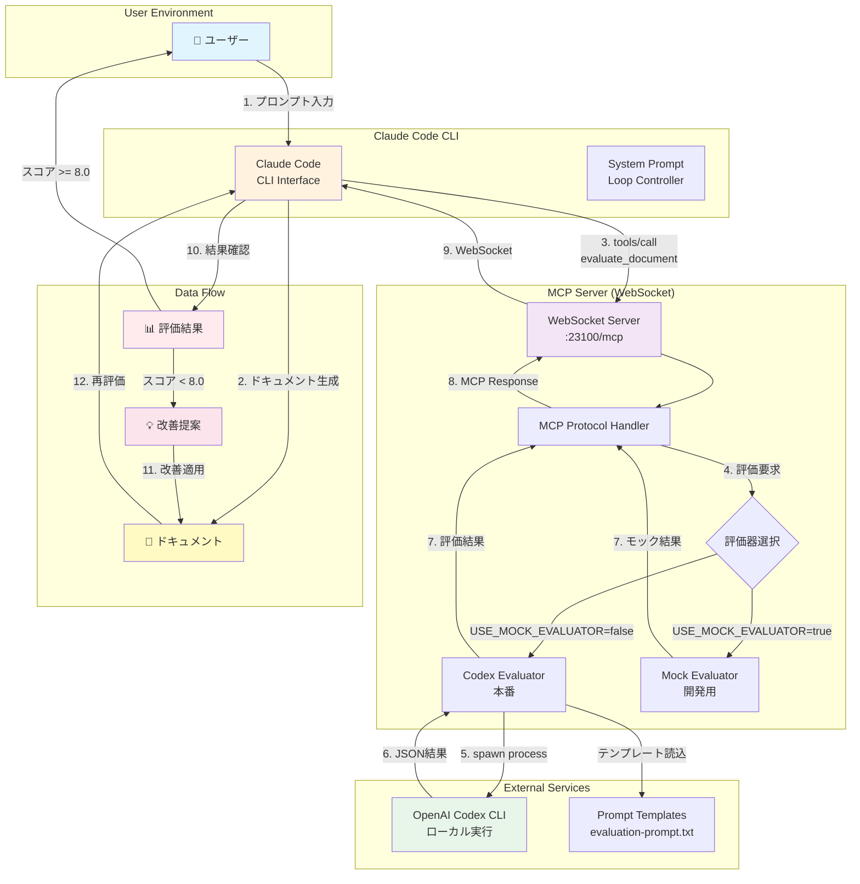

# LoopSmith アーキテクチャ

## システム概要

LoopSmithは、Claude CodeとOpenAI Codexを連携させた自動ドキュメント評価・改善システムです。

## アーキテクチャ図



## コンポーネント詳細

### 1. Claude Code CLI
- **役割**: ユーザーインターフェースとループ制御
- **機能**:
  - ドキュメント生成
  - MCPツール呼び出し
  - 改善ループ管理
  - システムプロンプトによる自動化

### 2. MCP Server (WebSocket)
- **役割**: Claude CodeとCodexの仲介
- **プロトコル**: Model Context Protocol (MCP)
- **通信方式**: WebSocket (ws://localhost:23100/mcp)
- **主要メソッド**:
  - `initialize`: 初期化ハンドシェイク
  - `tools/list`: 利用可能ツール一覧
  - `tools/call`: ツール実行

### 3. 評価器 (Evaluator)
#### Codex Evaluator (本番)
- **実行方式**: child_process.spawn()
- **タイムアウト**: デフォルト5分（最大30分まで設定可能）
- **再試行**: 最大2回（指数バックオフ）
- **JSON抽出**: 多段階パース戦略

#### Mock Evaluator (開発)
- **用途**: テスト・デバッグ
- **評価ロジック**: 簡易ヒューリスティック
- **レスポンス**: 即座に返却

### 4. OpenAI Codex CLI
- **認証**: ~/.config/codex/auth.json
- **実行モード**: --full-auto
- **オプション**: --skip-git-repo-check, --format json
- **入出力**: stdin/stdout経由

## データフロー

### 正常フロー
```
1. ユーザーがプロンプトを入力
2. Claude Codeがドキュメントを生成
3. evaluate_documentツールを呼び出し
4. MCPサーバーが評価要求を受信
5. Codex CLIでドキュメントを評価
6. JSON形式で評価結果を返却
7. スコアが目標値未満なら改善
8. 改善後、再評価（最大5回）
9. 目標達成または終了条件で完了
```

### エラーハンドリング
```
- WebSocket切断 → 再接続試行
- Codexタイムアウト → 再試行（最大2回）
- JSON解析失敗 → フォールバック抽出
- プロンプト読込失敗 → デフォルト使用
```

## 設定ファイル

### 環境変数 (.env)
```bash
# サーバー設定
MCP_PORT=23100              # WebSocketポート
LOG_LEVEL=info              # ログレベル

# 評価設定
USE_MOCK_EVALUATOR=false    # モック使用フラグ
TARGET_SCORE=8.0            # 目標スコア
MAX_ITERATIONS=5            # 最大改善回数

# Codex設定
CODEX_TIMEOUT=300000        # タイムアウト(ms) デフォルト5分、最大30分
CODEX_MAX_BUFFER=20971520   # バッファサイズ
CODEX_SUPPORTS_JSON_FORMAT=true  # JSON出力

# プロンプト
EVALUATION_PROMPT_PATH=../prompts/evaluation-prompt.txt
```

### プロンプトテンプレート
```
prompts/
├── evaluation-prompt.txt    # 日本語版
└── evaluation-prompt-en.txt # 英語版
```

変数プレースホルダー:
- `{{completeness_weight}}`: 完全性の重み
- `{{accuracy_weight}}`: 正確性の重み
- `{{clarity_weight}}`: 明確性の重み
- `{{usability_weight}}`: 実用性の重み
- `{{document_content}}`: 評価対象

## 評価メトリクス

### 評価基準（Rubric）
| 基準 | デフォルト重み | 説明 |
|------|--------------|------|
| Completeness | 30% | 要求事項のカバレッジ |
| Accuracy | 30% | 技術的正確性 |
| Clarity | 20% | 理解しやすさ |
| Usability | 20% | 実装可能性 |

### スコア計算
```javascript
overall_score = 
  completeness * 0.3 +
  accuracy * 0.3 +
  clarity * 0.2 +
  usability * 0.2
```

## 改善ループアルゴリズム

```javascript
function evaluationLoop(document) {
  let iteration = 0;
  let currentDoc = document;
  let previousScore = 0;
  
  while (iteration < MAX_ITERATIONS) {
    // 評価実行
    const result = evaluate(currentDoc);
    
    // 終了条件チェック
    if (result.score >= TARGET_SCORE) {
      return { success: true, document: currentDoc };
    }
    
    // 改善停滞チェック
    if (Math.abs(result.score - previousScore) < 0.5) {
      stagnantCount++;
      if (stagnantCount >= 3) {
        return { success: false, reason: '改善停滞' };
      }
    }
    
    // 改善適用
    currentDoc = applyImprovements(currentDoc, result.suggestions);
    previousScore = result.score;
    iteration++;
  }
  
  return { success: false, reason: '最大反復回数到達' };
}
```

## セキュリティ考慮事項

### 認証・認可
- Codex CLI: ローカル認証ファイル使用
- MCPサーバー: ローカルホストのみバインド
- APIキー: 環境変数には保存しない

### データ保護
- プロンプトテンプレート: ローカルファイル
- 評価結果: メモリ内処理のみ
- ログ: APIキーのマスキング実装

### プロセス分離
- Codex実行: 子プロセスで分離
- タイムアウト: 5分（最大30分）でプロセス終了
- バッファ制限: 20MBで切り捨て

## パフォーマンス最適化

### キャッシュ戦略
- プロンプトテンプレート: 初回読込後メモリ保持
- 評価結果: 将来的にキャッシュ実装可能

### 並行処理
- WebSocket: 複数クライアント対応
- 評価: 現在は逐次処理（将来的に並列化可能）

### リソース管理
- メモリ: バッファサイズ制限
- CPU: プロセス数制限（現在は1）
- ネットワーク: ローカルのみ

## トラブルシューティングガイド

### よくある問題と解決方法

| 問題 | 原因 | 解決方法 |
|------|------|----------|
| WebSocket接続失敗 | ポート使用中 | MCP_PORTを変更 |
| Codex実行失敗 | CLIが見つからない | npm install -g @openai/codex |
| 評価タイムアウト | 処理時間超過 | CODEX_TIMEOUT増加 |
| JSON解析エラー | 出力形式不正 | CODEX_SUPPORTS_JSON_FORMAT=false |
| 改善停滞 | 提案が不十分 | プロンプトテンプレート調整 |

## 今後の拡張可能性

### 機能拡張
- [ ] 複数言語対応
- [ ] カスタム評価基準
- [ ] バッチ処理モード
- [ ] Web UI追加
- [ ] 評価履歴保存

### 統合拡張
- [ ] GitHub Actions連携
- [ ] VS Code拡張機能
- [ ] Slack通知
- [ ] CI/CDパイプライン

### パフォーマンス改善
- [ ] 評価結果キャッシュ
- [ ] 並列評価処理
- [ ] ストリーミング対応
- [ ] 分散処理対応