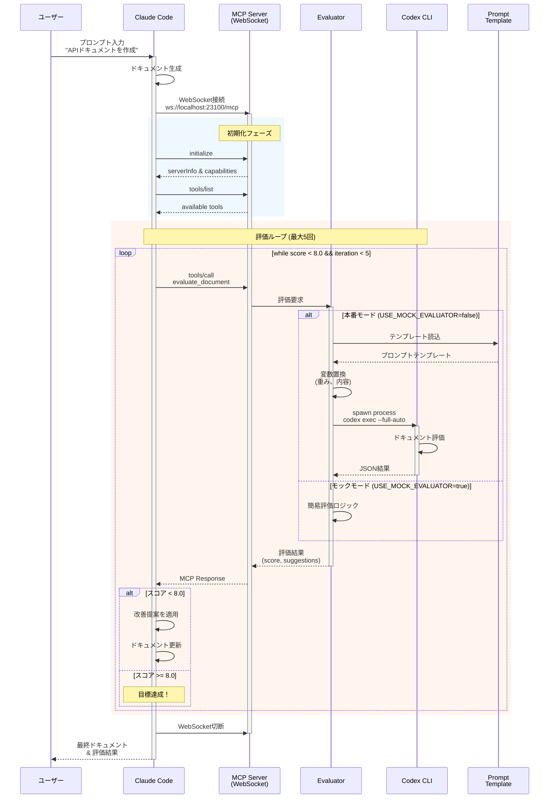
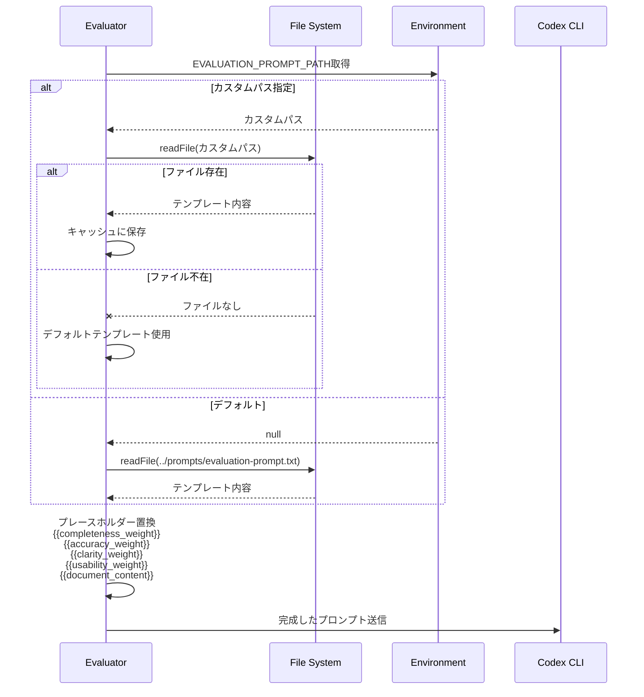
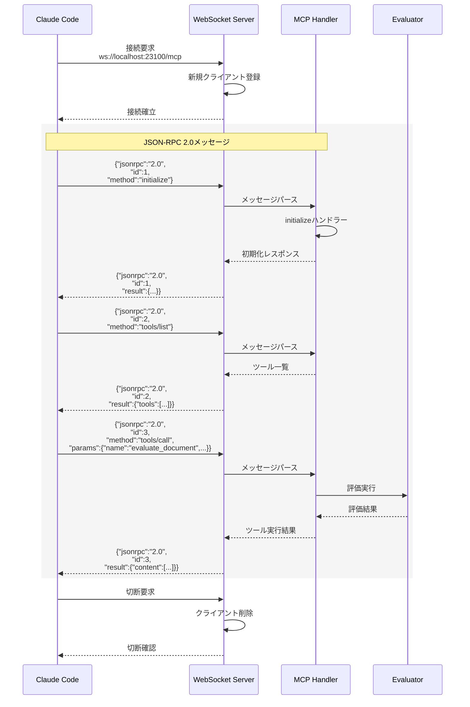
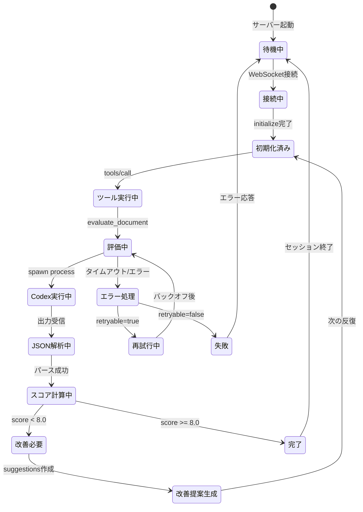

# LoopSmith シーケンス図

## 基本的な評価フロー



## エラーハンドリングフロー

```mermaid
sequenceDiagram
    participant CC as Claude Code
    participant WS as MCP Server
    participant EV as Evaluator
    participant CX as Codex CLI
    
    CC->>WS: tools/call<br/>evaluate_document
    WS->>EV: 評価要求
    activate EV
    
    rect rgb(255, 235, 238)
        Note over EV,CX: エラー処理と再試行
        loop 最大3回試行
            EV->>CX: spawn process
            activate CX
            
            alt 正常終了
                CX-->>EV: JSON結果
                deactivate CX
                Note over EV: 成功 - ループ終了
            else タイムアウト (120秒)
                CX--xEV: タイムアウト
                deactivate CX
                EV->>EV: 指数バックオフ<br/>(1秒, 2秒, 4秒)
            else プロセスエラー
                CX--xEV: エラー終了
                alt retryable = true
                    EV->>EV: 再試行準備
                else retryable = false
                    Note over EV: 即座に失敗
                end
            end
        end
    end
    
    alt 全試行失敗
        EV-->>WS: エラーレスポンス<br/>code: -32603
        WS-->>CC: エラー通知
        CC->>CC: フォールバック処理
    else 成功
        EV-->>WS: 評価結果
        deactivate EV
        WS-->>CC: 正常レスポンス
    end
```

## プロンプトテンプレート処理



## WebSocket通信詳細



## 状態遷移図



## データ構造

### 評価要求 (EvaluationRequest)
```typescript
{
  content: string,           // 評価対象ドキュメント
  rubric?: {                // 評価基準（オプション）
    completeness: number,    // 完全性の重み
    accuracy: number,        // 正確性の重み
    clarity: number,         // 明確性の重み
    usability: number        // 実用性の重み
  },
  target_score?: number      // 目標スコア
}
```

### 評価結果 (EvaluationResponse)
```typescript
{
  score: number,             // 総合スコア (0-10)
  rubric_scores: {           // 各基準のスコア
    completeness: number,
    accuracy: number,
    clarity: number,
    usability: number
  },
  pass: boolean,             // 合格判定
  suggestions: string[],     // 改善提案
  metadata?: {               // メタデータ
    iteration?: number,      // 反復回数
    evaluation_time?: number,// 評価時間(ms)
    model_used?: string      // 使用モデル
  }
}
```

### MCPメッセージ形式
```typescript
{
  jsonrpc: "2.0",           // プロトコルバージョン
  id: number | string,      // リクエストID
  method?: string,          // メソッド名
  params?: any,             // パラメータ
  result?: any,             // 成功結果
  error?: {                 // エラー情報
    code: number,           // エラーコード
    message: string,        // エラーメッセージ
    data?: any              // 追加情報
  }
}
```